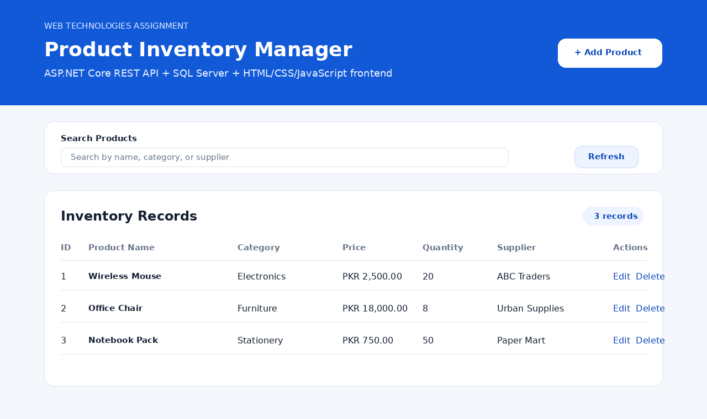

# Product Inventory Manager

This is a simple **Product Inventory Manager** web application built for the Web Technologies Database Connectivity Assignment.

The project is divided into separate folders:

- `Backend` — ASP.NET Core REST API with SQL Server database connectivity
- `Frontend` — HTML, CSS, and JavaScript pages that call the backend REST API

## Assignment Requirements Covered

- HTML, CSS, and JavaScript frontend
- ASP.NET Core backend
- SQL Server database
- REST API connection between frontend and backend
- Fetch and display records using GET
- Add new record using POST
- Update existing record using PUT
- Delete record using DELETE
- Client-side form validation before submission
- Server-side validation in backend
- Minimum two pages:
  - `Frontend/index.html`
  - `Frontend/product-form.html`

## Project Structure

```text
ProductInventoryManager/
├── Backend/
│   ├── Data/
│   │   └── AppDbContext.cs
│   ├── Models/
│   │   └── Product.cs
│   ├── Properties/
│   │   └── launchSettings.json
│   ├── SQL/
│   │   └── CreateDatabase.sql
│   ├── Program.cs
│   ├── appsettings.json
│   └── ProductInventoryManager.Api.csproj
├── Frontend/
│   ├── css/
│   │   └── site.css
│   ├── js/
│   │   ├── api.js
│   │   ├── index.js
│   │   └── product-form.js
│   ├── screenshots/
│   │   └── home-screen.png
│   ├── index.html
│   └── product-form.html
├── README.md
└── .gitignore
```

## Screenshot



## Required Software

Install these before running the project:

1. .NET 8 SDK
2. SQL Server LocalDB or SQL Server Express
3. Visual Studio Code or Visual Studio
4. Live Server extension in VS Code, or any simple static file server for frontend

## Database Connection

The backend uses SQL Server LocalDB by default.

File:

```text
Backend/appsettings.json
```

Default connection string:

```json
"DefaultConnection": "Server=(localdb)\\MSSQLLocalDB;Database=ProductInventoryDb;Trusted_Connection=True;MultipleActiveResultSets=true;TrustServerCertificate=True"
```

The database is created automatically when the backend runs because the project uses:

```csharp
db.Database.EnsureCreated();
```

If you are using SQL Server Express instead of LocalDB, replace the connection string with:

```json
"DefaultConnection": "Server=.\\SQLEXPRESS;Database=ProductInventoryDb;Trusted_Connection=True;MultipleActiveResultSets=true;TrustServerCertificate=True"
```

A manual SQL script is also available here:

```text
Backend/SQL/CreateDatabase.sql
```

## How to Run the Project

### Step 1: Extract the ZIP file

Extract the project folder.

### Step 2: Open terminal in the backend folder

```bash
cd ProductInventoryManager/Backend
```

### Step 3: Restore backend packages

```bash
dotnet restore
```

### Step 4: Run the backend API

```bash
dotnet run
```

The backend will run at:

```text
http://localhost:5000
```

Test API in browser:

```text
http://localhost:5000/api/products
```

### Step 5: Run the frontend

Open the `Frontend` folder in VS Code.

Right-click this file:

```text
Frontend/index.html
```

Then click:

```text
Open with Live Server
```

The frontend will open in the browser, usually at:

```text
http://127.0.0.1:5500/Frontend/index.html
```

### Step 6: Test CRUD Operations

1. Open the main page.
2. Click **Add Product**.
3. Enter product details and save.
4. Check that the product appears on the main page.
5. Click **Edit** to update the product.
6. Click **Delete** to remove the product.

## API Endpoints

| Method | Endpoint | Purpose |
|---|---|---|
| GET | `/api/products` | Get all products |
| GET | `/api/products/{id}` | Get one product |
| POST | `/api/products` | Add new product |
| PUT | `/api/products/{id}` | Update product |
| DELETE | `/api/products/{id}` | Delete product |

## Product Fields

| Field | Validation |
|---|---|
| Product Name | Required, maximum 100 characters |
| Category | Required, maximum 60 characters |
| Price | Required, must be greater than 0 |
| Quantity | Required, whole number, cannot be negative |
| Supplier | Optional, maximum 100 characters |

## GitHub Submission Steps

Run these commands from the main project folder:

```bash
git init
git add .
git commit -m "Product inventory manager assignment"
```

Create a public GitHub repository, then run:

```bash
git remote add origin YOUR_GITHUB_REPO_URL
git branch -M main
git push -u origin main
```

Submit the public GitHub repository link on LMS.
